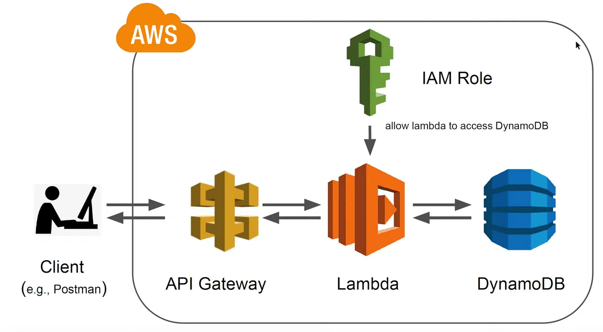
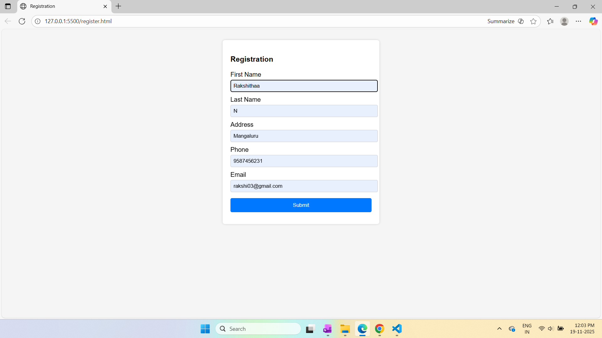
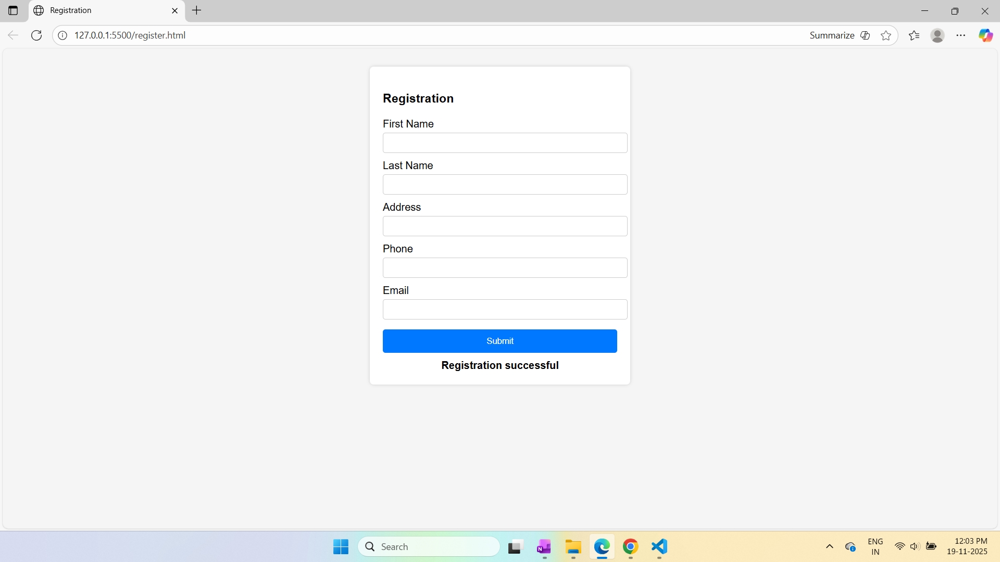

# Serverless REST API using AWS Lambda, API Gateway and DynamoDB

This project demonstrates how to build a fully serverless REST API using AWS Lambda, API Gateway and DynamoDB. The setup allows clients to interact with backend resources without managing servers. AWS handles compute, routing and data storage. The guide covers concepts, architecture and project structure.

---

## Concepts

### Serverless REST API
A backend that runs without provisioning or maintaining servers. AWS handles scaling and availability automatically.

### Key Features
- No server management
- Pay only for what you use
- Automatic scaling
- High availability
- Easy to extend with AWS services

### Components
- API Gateway: Entry point for all HTTP requests
- Lambda: Executes backend logic
- DynamoDB: Fast, serverless NoSQL database

---

## Deployment Steps

Full deployment instructions:  
See full deployment instructions [here](docs/deployment-steps.md)

---
## Project Structure
```
serverless-api-integration/
│
├── docs/
│ ├── deployment-steps.md 
│ └── screenshots/
│ 	├── dynamodb_data.png 
│ 	├── registration_form.png
│ 	├── registration_success.png
│ 	└── architecture.png # Architecture diagram
├── README.md
├── api.js
├── lamba_function.py
├── register.html 
└── LICENSE 
```

---

## Architecture Diagram

**Serverless REST API Architecture**  


- The client sends an HTTP POST request.
- API Gateway receives the request and routes it to the correct Lambda function.
- The Lambda function executes the backend logic.
- Lambda reads or writes data in DynamoDB.
- API Gateway sends the response back to the client.

---

## Screenshots

**Registration Form**  


**Registration Success Message**  


**DynamoDB Stored Data**  


---

## License

MIT License. See `LICENSE` file for details.

