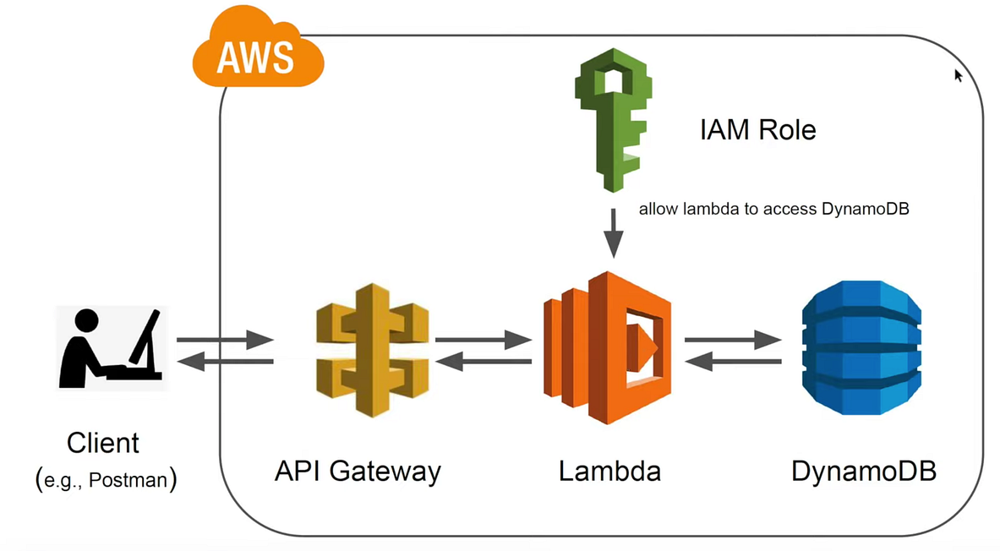
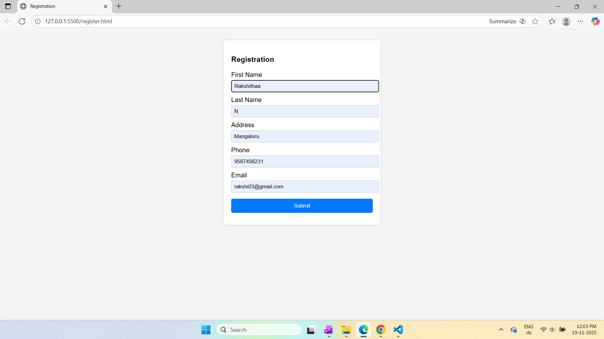
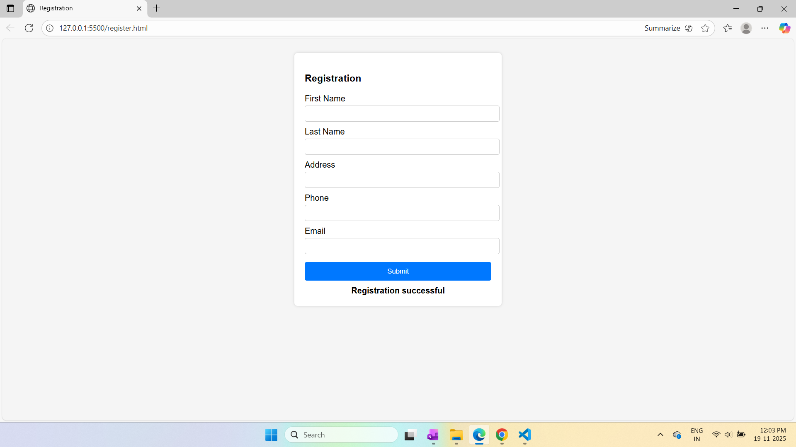
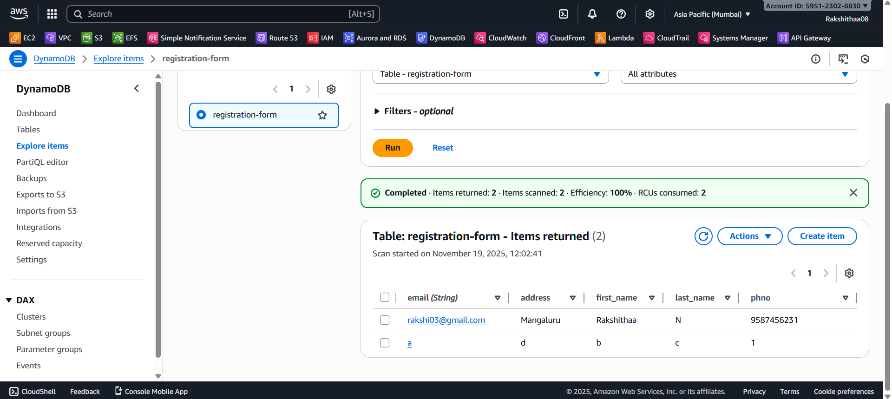

# Serverless REST API using AWS Lambda, API Gateway and DynamoDB

This project demonstrates how to build a fully serverless REST API using AWS Lambda, API Gateway and DynamoDB. The setup allows clients to interact with backend resources without managing servers. AWS handles compute, routing and data storage. The guide covers concepts, architecture and project structure.

---

## Concepts

### Serverless REST API
A backend that runs without provisioning or maintaining servers. AWS handles scaling and availability automatically.

### Components
- API Gateway: Entry point for all HTTP requests
- Lambda: Executes backend logic
- DynamoDB: Fast, serverless NoSQL database

### How It Works
1. Client sends an HTTP POST request
2. API Gateway receives and routes it to the correct Lambda function
3. Lambda executes the backend logic
4. Lambda reads or writes data in DynamoDB
5. API Gateway returns the response to the client

### Technologies Used
- AWS Lambda
- AWS API Gateway
- AWS DynamoDB
- Python (Lambda function)
- JavaScript (API integration)
- HTML (Frontend form)
---
## Prerequisites
- AWS account with appropriate IAM permissions
- AWS CLI configured
- Basic knowledge of AWS Lambda, API Gateway and DynamoDB
---
## Deployment Steps

Full deployment instructions:  
See full deployment instructions [here](docs/deployment-steps.md)

---
## Project Structure
```
serverless-api-integration/
│
├── docs/
│   ├── deployment-steps.md
│   └── screenshots/
│       ├── dynamodb_data.png
│       ├── registration_form.png
│       ├── registration_success.png
│       └── architecture.png
├── api.js
├── lambda_function.py
├── register.html
├── README.md
└── LICENSE
```

---

## Architecture Diagram


---

## Screenshots

**Registration Form**  


**Registration Success Message**  


**DynamoDB Stored Data**  


---

## About This Project
Built to demonstrate a fully serverless backend architecture on AWS. No servers to manage — AWS handles compute, routing, and storage automatically. Suitable as a reference for building lightweight, scalable REST APIs using AWS managed services.

---
## License

MIT License. See `LICENSE` file for details.

